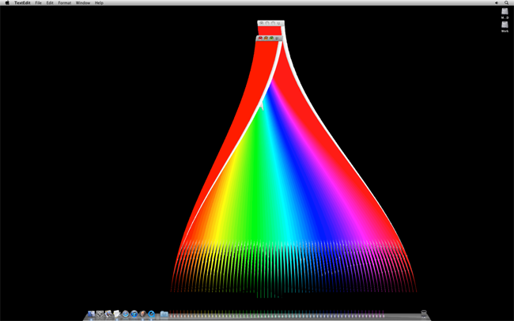

# A Vernacular Web
* Olia Lialina, 2005
* Download PDF: [interface-aesthetics.pdf](interface-aesthetics.pdf)
* Link to essay: [http://rhizome.org/editorial/2012/aug/3/interface-aesthetics/](http://rhizome.org/editorial/2012/aug/3/interface-aesthetics/)

Everyday we use digital tools to create, edit, and document our work. We click fastidiously into the graphical user interface (GUI) of applications, seeing expected results while trying to ignore the friction of bad design, failed UX, and glitches. Most actions are conducted successfully and the interface holds its transparent position. But despite the GUI’s seemingly innocuous presence, its aesthetic leaches its way into our own. How we view our creative process and documentation is minutely and incrementally shifted by the frame of the interfaces we routinely use.