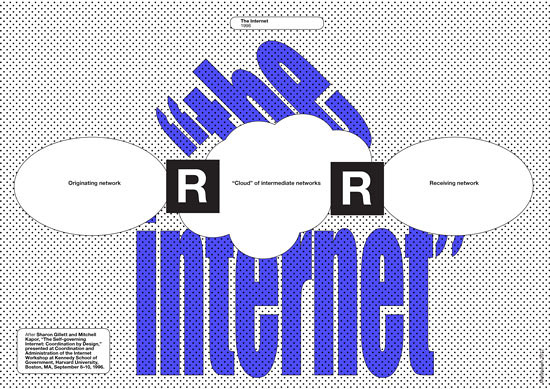

# Captives of the Cloud Part 1
* Metahaven, 2012
* Download PDF: [captives-of-the-cloud.pdf](captives-of-the-cloud.pdf)
* Link to essay: [http://www.e-flux.com/journal/37/61232/captives-of-the-cloud-part-i/](http://www.e-flux.com/journal/37/61232/captives-of-the-cloud-part-i/)
* e-flux, Journal #37 - September 2012

Wael Ghonim, Google's Egyptian executive, said: “If you want to liberate a society just give them the internet.” But how does one liberate a society that already has the internet? In a society permanently connected through pervasive broadband networks, the shared internet is, bit by bit and piece by piece, overshadowed by the “cloud.”